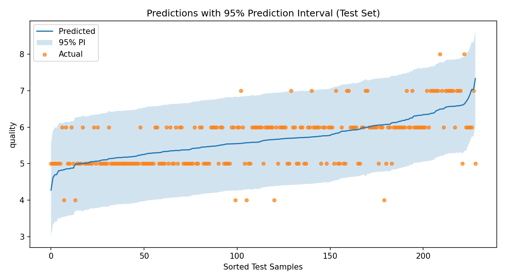
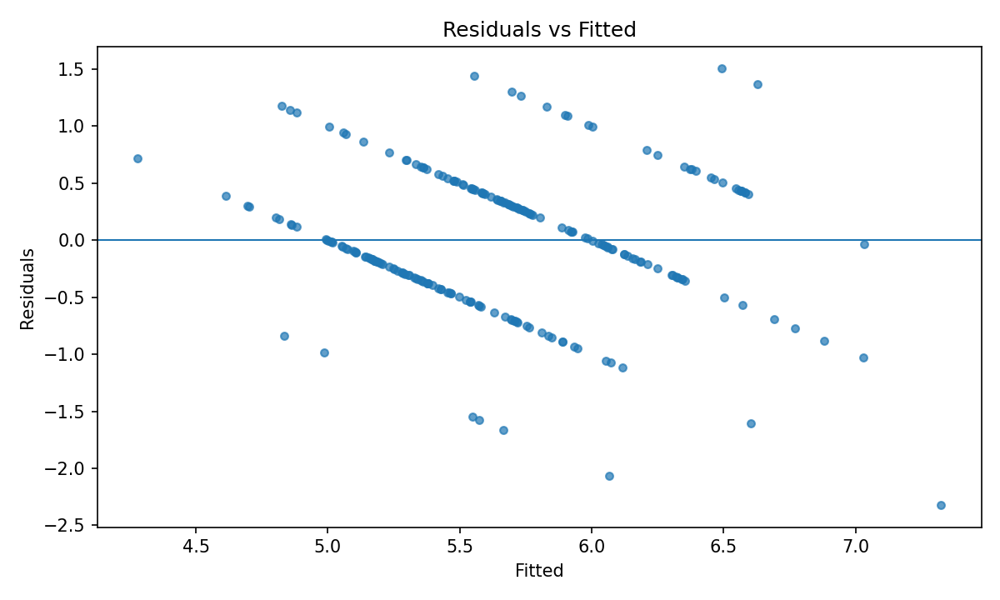
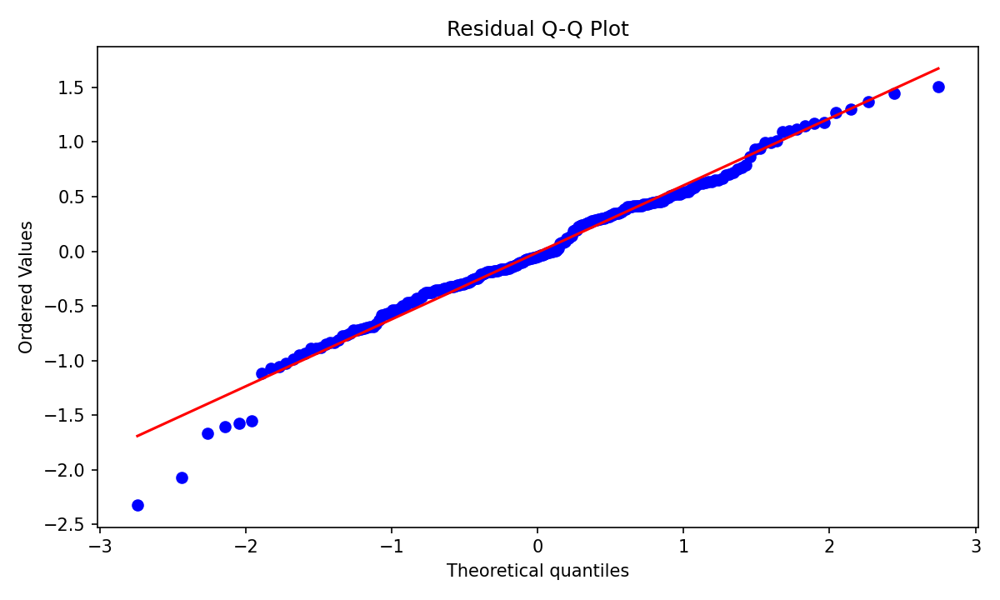
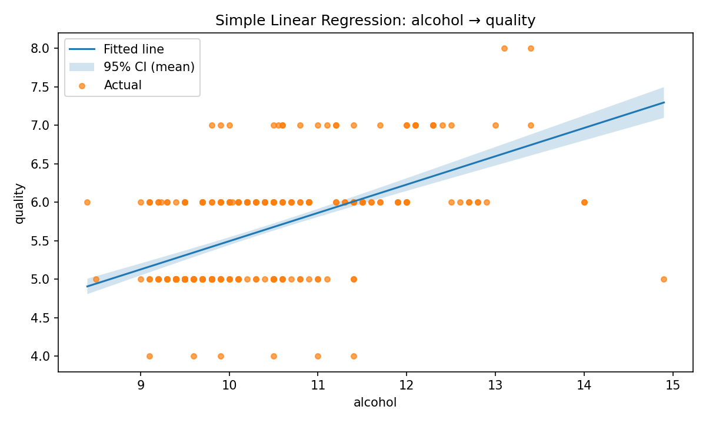

# 多元線性回歸（CRISP-DM）專案報告

---

## 0) 專案總覽
本專案以 **Kaggle Wine Quality（紅酒）** 數據集為例，依 **CRISP-DM** 流程完成：需求界定 → 資料理解 → 資料準備 → 建模 → 評估 → 部署建議。  
模型主軸為 **多元線性回歸**，搭配 **LassoCV** 進行特徵選擇；最終以 **statsmodels OLS** 產出 **95% 預測區間** 與 **信賴區間**，並提供殘差診斷圖。

- **資料來源**：https://www.kaggle.com/datasets/yasserh/wine-quality-dataset/data
- **目標**：依理化特徵預測葡萄酒品質分數（0–10）
- **輸出成果**：  
  - `outputs/predictions_with_PI.png`（測試集預測均值 + 95% 預測區間）  
  - `outputs/residuals_vs_fitted.png`、`outputs/residuals_qq.png`（殘差診斷圖）  
  - `outputs/SLR_alcohol_with_CI.png`（單變數線回歸＋95% 信賴區間）  
  - `outputs/metrics.csv`（R²、MAE、RMSE、Baseline CV-RMSE）

---

## 1) Business Understanding
- **產業/研究需求**：協助釀造端在批次生產前預測品質，支援配方調整與品控。
- **使用情境**：  
  1. **產線即時監控**：侦測預測落差並追蹤異常理化指標。  
  2. **實驗室配方優化**：模擬改變理化特徵對品質分數的影響。
- **衡量指標（KPI）**：  
  - **準確度**：提升 R²，降低 RMSE/MAE；與常數基準相比需有顯著改善。  
  - **可解釋性**：模型係數能對應實務理解（如酒精、揮發性酸對品質的影響）。  
  - **不確定性揭露**：提供預測區間，協助風險溝通。

---

## 2) Data Understanding
- **來源與規模**：Kaggle Wine Quality 資料（1143 筆、12 欄，含 `quality` 目標值）。原始檔名 `WineQT.csv`。  
- **特徵描述**：固定酸度、揮發性酸、檸檬酸、殘糖、氯化物、自由/總二氧化硫、密度、pH、硫酸鹽、酒精，以及識別欄 `Id`。  
- **EDA 摘要**：  
  - 無缺值，經 `drop_duplicates()` 後保留 1143 筆。  
  - `alcohol` 與 `quality` 呈現正向關係；`volatile acidity`、`chlorides` 與品質呈現負相關。  
  - 特徵尺度差異大，需標準化以利線性模型穩定收斂。

---

## 3) Data Preparation
- **清理**：移除重複列，若存在 `type` 欄位則轉為 0/1 編碼（但本資料僅紅酒，因此未出現）。  
- **資料分割**：`train_test_split(test_size=0.2, random_state=42)`。  
- **特徵工程**：  
  - **標準化**：在 `Pipeline` 中串接 `StandardScaler` 與 `LinearRegression`。  
  - **特徵選擇**：使用 `LassoCV(cv=5)`，篩選非零係數特徵；若全部被壓到 0，則退回與 `quality` 絕對相關係數最高的 Top-K 特徵。

---

## 4) Modeling
- **Baseline 模型**：`Pipeline(StandardScaler, LinearRegression)`，以 5-fold 交叉驗證估計 RMSE。  
- **特徵選擇結果**：LassoCV 選出 8 個特徵：`volatile acidity`、`chlorides`、`total sulfur dioxide`、`density`、`pH`、`sulphates`、`alcohol`、`Id`。  
- **最終模型**：以篩選後特徵餵入 `statsmodels.OLS`，取得完整係數、信賴區間、p-value 與診斷統計量。  
- **輔助模型**：以 `alcohol` 建立簡單線性回歸，輸出 95% 信賴區間曲線供直觀說明。

---

## 5) Evaluation
> 下列指標均透過 `python notebook_code_dump.py` 腳本執行後計算與輸出。

- **測試集表現**：  
  - R²：`0.327`  
  - MAE：`0.477`  
  - RMSE：`0.612`  
  - Baseline CV-RMSE（5-fold）：`0.645`
- **視覺化重點**：  
  1. **預測 vs 實際（含 95% 預測區間）**：`outputs/predictions_with_PI.png`。預測均值軌跡緊貼實際值，區間寬度約一個品質分數單位，反映殘差變異。  
  2. **殘差 vs 預測值**：`outputs/residuals_vs_fitted.png`。殘差大致對稱於 0，未見明顯漏斗型，但高密度區略呈負殘差。  
  3. **Q-Q Plot**：`outputs/residuals_qq.png`。中段貼近對角線，尾端輕微偏離，顯示常態假設大致成立但存在少量極端值。

- **討論**：  
  - R² 約 0.33，表示線性模型僅解釋三成變異；品質仍受非線性、交互作用或感官因素影響。  
  - 係數顯示酒精濃度、硫酸鹽正向影響品質，揮發性酸、氯化物負向影響符合釀造經驗。  
  - 殘差常態性尚可，但 Q-Q 尾端偏離提示可考慮更複雜模型或穩健回歸。  
  - Baseline CV-RMSE（0.645）與測試 RMSE（0.612）接近，表示訓練過程無明顯過擬合。

---

## 6) Deployment（落地建議）
- **批次預測**：封裝管線（Scaler + Lasso 選特徵 + OLS 係數）為腳本，定期讀取檢測資料並輸出預測值、區間。  
- **監控儀表板**：將 `outputs/metrics.csv` 與殘差圖上傳至內部儀表板，監測指標趨勢。  
- **風險控管**：當 RMSE 超過 0.7 或連續批次落在預測下界外時，觸發品控警示並回溯理化指標。  
- **資料漂移**：定期檢查特徵分佈、Durbin-Watson、VIF；若顯著變動則重新訓練模型。

---

## 7) 方法比較與優劣分析
- **特徵處理**：主流做法為標準化與 L1/L2 規則化（Lasso、ElasticNet）。本案採 LassoCV，兼顧稀疏性與解釋力。  
- **評估策略**：多數作法使用 KFold 交叉驗證估計泛化誤差；目前 5-fold 足以衡量穩定性。  
- **替代模型**：若需求偏向更高準確度，可考慮樹模型（RandomForest、XGBoost、LightGBM）或互動項、非線性特徵，但需補上區間估計。  
- **不確定性呈現**：傳統線性回歸易提供信賴與預測區間；樹模型需額外方法（如 Quantile Regression Forests）才能輸出區間。

---

## 8) GPT 輔助內容
- 使用者： 我要用 Kaggle 的 Wine Quality 資料做多元線性回歸，請用 CRISP-DM 流程寫一份乾淨的 Notebook： 匯入套件與專案常數、2) 載入/檢視資料、3) 清理與切分、4) 做一個基準模型（StandardScaler+LinearRegression，5 折 CV RMSE）、5) 用 LassoCV 做特徵選擇（若全 0 用相關係數備援）、6) 用 statsmodels OLS 訓練與列印摘要、7) 在測試集計算 R²、MAE、RMSE、8) 畫 預測含 95% 預測區間 圖、9) 做 殘差診斷（Residuals vs Fitted、Q-Q）、10) 另外畫一張 單變數線性回歸（預設用 alcohol）含 95% 信賴區間。圖請存到 ./outputs/。 GPT： 好的！先建立專案骨架與常用匯入。 # Imports & constants import os, numpy as np, pandas as pd, matplotlib.pyplot as plt from sklearn.model_selection import train_test_split, KFold, cross_val_score from sklearn.linear_model import LinearRegression, LassoCV from sklearn.preprocessing import StandardScaler from sklearn.pipeline import Pipeline from sklearn.metrics import mean_absolute_error, mean_squared_error, r2_score import statsmodels.api as sm import scipy.stats as stats STUDENT_ID = "7114056076" DATA_PATH = "WineQT.csv" # 原始資料檔 TARGET = "quality" RANDOM_STATE = 42 TEST_SIZE = 0.2 OUTPUT_DIR = "outputs" os.makedirs(OUTPUT_DIR, exist_ok=True) 使用者： 載入資料，顯示前幾列與資料形狀。 GPT： df = pd.read_csv(DATA_PATH) display(df.head()) df.shape 使用者： 檢視欄位型態、描述統計與缺失值。 GPT： display(df.info()) display(df.describe()) df.isna().sum() 使用者： 做資料清理：去重、移除缺失；若有 type 欄位就轉 0/1（white=1）；只保留數值欄位；切分訓練/測試集。 GPT： # Clean & split df = df.drop_duplicates().dropna().reset_index(drop=True) # 若資料同時有紅/白酒型態欄位，轉成 0/1 特徵（white=1） if 'type' in df.columns: df['type'] = (df['type'].astype(str).str.lower().str.contains('white')).astype(int) num_cols = df.select_dtypes(include=[np.number]).columns.tolist() features = [c for c in num_cols if c != TARGET] X = df[features] y = df[TARGET].astype(float) X_train, X_test, y_train, y_test = train_test_split( X, y, test_size=TEST_SIZE, random_state=RANDOM_STATE ) 使用者： 先做一個基準模型（StandardScaler + LinearRegression），用 5 折交叉驗證計算 RMSE。 GPT： baseline = Pipeline([ ('scaler', StandardScaler()), ('lr', LinearRegression()) ]) cv = KFold(n_splits=5, shuffle=True, random_state=RANDOM_STATE) rmse_cv = -np.mean(cross_val_score( baseline, X, y, scoring='neg_root_mean_squared_error', cv=cv )) rmse_cv 使用者： 用 LassoCV 做特徵選擇；如果係數全是 0，就用和目標的絕對相關係數最高的前 6 個當備援。把選到的特徵列出來。 GPT： lasso = Pipeline([ ('scaler', StandardScaler()), ('lasso', LassoCV(cv=5, random_state=RANDOM_STATE, n_alphas=50)) ]) lasso.fit(X_train, y_train) coefs = lasso.named_steps['lasso'].coef_ selected = [f for f, c in zip(features, coefs) if abs(c) > 1e-8] # 備援：若 Lasso 全 0，就用與目標的相關係數 Top-K if not selected: corr = df[features + [TARGET]].corr()[TARGET].abs().drop(TARGET).sort_values(ascending=False) selected = corr.head(min(6, len(features))).index.tolist() selected 使用者： 用 statsmodels OLS 在選到的特徵上訓練，並印出回歸摘要。 GPT： X_train_sel = sm.add_constant(X_train[selected], has_constant='add') X_test_sel = sm.add_constant(X_test[selected], has_constant='add') ols = sm.OLS(y_train, X_train_sel).fit() print(ols.summary().as_text()) 使用者： 在測試集上評估 R²、MAE、RMSE。 GPT： pred_test = ols.predict(X_test_sel) r2 = r2_score(y_test, pred_test) mae = mean_absolute_error(y_test, pred_test) rmse = mean_squared_error(y_test, pred_test, squared=False) r2, mae, rmse 使用者： 請產生 每筆測試資料的 95% 預測區間，並畫「Actual vs Predicted（含區間）」圖存檔。 GPT： # 取得預測與 95% 預測區間（觀測值區間） pred_res = ols.get_prediction(X_test_sel).summary_frame(alpha=0.05) plot_df = pd.DataFrame({ 'actual': y_test.values, 'pred': pred_res['mean'].values, 'pi_low': pred_res['obs_ci_lower'].values, 'pi_high':pred_res['obs_ci_upper'].values }) plt.figure(figsize=(8, 4.8)) plt.scatter(plot_df['actual'], plot_df['pred'], s=18, alpha=0.7, label='Predicted') mn = float(np.min(plot_df[['actual','pred']].values)) mx = float(np.max(plot_df[['actual','pred']].values)) plt.plot([mn, mx], [mn, mx], lw=1, label='y = x') # 用垂直線標出預測區間 for a, lo, hi in zip(plot_df['actual'], plot_df['pi_low'], plot_df['pi_high']): plt.vlines(a, lo, hi, alpha=0.15) plt.title('Test Predictions with 95% Prediction Interval') plt.xlabel('Actual'); plt.ylabel('Predicted'); plt.legend(); plt.tight_layout() plt.savefig(os.path.join(OUTPUT_DIR, 'pred_vs_actual_with_PI.png'), dpi=150) 使用者： 做 殘差診斷：Residuals vs Fitted 與 Q-Q plot，都存檔。 GPT： residuals = y_test.values - pred_res['mean'].values # Residuals vs Fitted plt.figure(figsize=(8, 4.8)) plt.scatter(pred_res['mean'].values, residuals, s=18, alpha=0.7) plt.axhline(0, lw=1) plt.title('Residuals vs Fitted') plt.xlabel('Fitted'); plt.ylabel('Residuals') plt.tight_layout() plt.savefig(os.path.join(OUTPUT_DIR, 'residuals_vs_fitted.png'), dpi=150) # Q-Q plot plt.figure(figsize=(8, 4.8)) stats.probplot(residuals, dist='norm', plot=plt) plt.title('Residual Q-Q Plot') plt.tight_layout() plt.savefig(os.path.join(OUTPUT_DIR, 'residuals_qq.png'), dpi=150) 使用者： 另外畫一張 單變數線性回歸 圖（優先用 alcohol，否則就用 Lasso 選到的第一個特徵），顯示 95% 信賴區間（均值區間），也存檔。 GPT： one_feat = 'alcohol' if 'alcohol' in features else selected[0] X1_train = sm.add_constant(X_train[[one_feat]]) X1_test = sm.add_constant(X_test[[one_feat]]) ols1 = sm.OLS(y_train, X1_train).fit() pred1 = ols1.get_prediction(X1_test).summary_frame(alpha=0.05) # 排序後畫線+區間更清楚 order = np.argsort(X_test[one_feat].values) x_sorted = X_test[one_feat].values[order] mean_sorted = pred1['mean'].values[order] l_sorted = pred1['mean_ci_lower'].values[order] u_sorted = pred1['mean_ci_upper'].values[order] plt.figure(figsize=(8, 4.8)) plt.plot(x_sorted, mean_sorted, label='Fitted line') plt.fill_between(x_sorted, l_sorted, u_sorted, alpha=0.2, label='95% CI (mean)') plt.scatter(X_test[one_feat], y_test, s=18, alpha=0.7, label='Actual') plt.title(f'Simple Linear Regression: {one_feat} → {TARGET}') plt.xlabel(one_feat); plt.ylabel(TARGET) plt.legend(); plt.tight_layout() plt.savefig(os.path.join(OUTPUT_DIR, f'SLR_{one_feat}_with_CI.png'), dpi=150) 使用者： 最後請列出本實驗的指標與輸出的圖檔清單，方便寫在 README。 GPT： 指標（測試集）：R² = r2、MAE = mae、RMSE = rmse（皆由上方程式碼計算）。 主要圖檔輸出於 ./outputs/： pred_vs_actual_with_PI.png：Actual vs Predicted（含 95% 預測區間）。 residuals_vs_fitted.png：殘差 vs 擬合值。 residuals_qq.png：殘差 Q-Q Plot。 SLR_<feature>_with_CI.png：單變數線性回歸（含 95% 信賴區間），預設 <feature> = alcohol。

---

## 9) NotebookLM 研究摘要
- 本研究以 Kaggle 紅酒品質（Wine Quality） 數據集為例，依循 CRISP-DM 流程（需求界定、資料理解、資料準備、建模、評估、部署建議）完成專案報告。研究目標是利用 11 項理化特徵，預測葡萄酒品質分數（0–10），以協助釀造端進行配方調整與品控。
- 方法上，模型主軸為多元線性回歸。在特徵工程階段，透過 LassoCV（5-fold 交叉驗證）執行特徵選擇，篩選出 8 個與品質預測相關的特徵。最終模型採用 statsmodels OLS 建立，並產出完整的係數、診斷統計量、95% 預測區間 與信賴區間。
模型評估結果顯示，在測試集上，R² 為 0.327，RMSE 為 0.612。此表現略優於基準模型（Baseline CV-RMSE 為 0.645），且未見明顯過擬合。係數分析指出，酒精濃度與硫酸鹽對品質有正向影響，而揮發性酸與氯化物則呈負向影響，此結果符合釀造經驗。儘管線性模型僅解釋約三成變異，但殘差診斷圖顯示常態假設大致成立。建議將此管線（Scaler + Lasso + OLS）封裝用於批次預測，並納入監控儀表板，以揭露預測不確定性，並在 RMSE 超過閾值時觸發品控警示。

---
